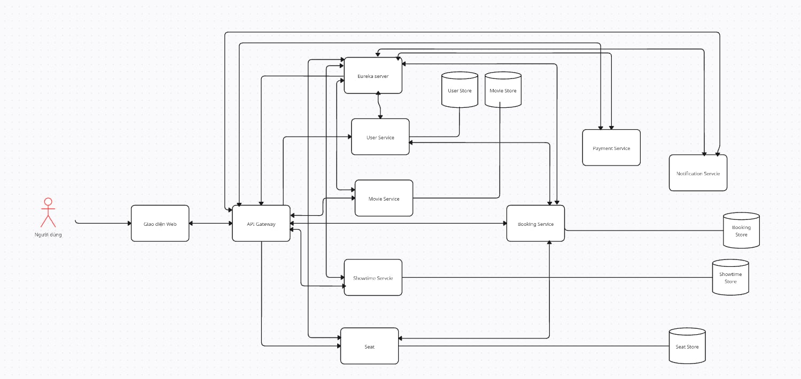

# Kiến Trúc Hệ Thống

## Tổng Quan
- Hệ thống microservice đặt vé xem phim trực tuyến.
- Các thành phần chính: các dịch vụ chức năng, API Gateway, Service Discovery.
- Mỗi dịch vụ đảm nhận một vai trò riêng biệt và có thể mở rộng độc lập.

## Thành Phần Hệ Thống

- **Dịch vụ Người Dùng (User Service):** Quản lý tài khoản, xác thực, hồ sơ người dùng.
- **Dịch vụ Phim (Movie Service):** Quản lý thông tin phim, danh mục, đánh giá.
- **Dịch vụ Suất Chiếu (Showtime Service):** Quản lý lịch chiếu, phòng chiếu, suất chiếu.
- **Dịch vụ Ghế Ngồi (Seat Service):** Quản lý sơ đồ ghế, trạng thái ghế.
- **Dịch vụ Đặt Vé (Booking Service):** Xử lý đặt vé, quản lý đơn đặt vé.
- **Dịch vụ Thanh Toán (Payment Service):** Xử lý thanh toán, quản lý giao dịch.
- **Dịch vụ Thông Báo (Notification Service):** Gửi email xác nhận, thông báo hệ thống.
- **API Gateway:** Định tuyến, xác thực, bảo mật, điểm vào duy nhất cho client.

## Giao Tiếp
- Các dịch vụ giao tiếp qua REST API (HTTP).
- Các dịch vụ sử dụng tên dịch vụ nội bộ trong Docker Compose để gọi nhau.

## Luồng Dữ Liệu
- Người dùng gửi yêu cầu qua API Gateway.
- Gateway xác thực và chuyển tiếp đến dịch vụ phù hợp.
- Dữ liệu có thể đi qua nhiều dịch vụ (ví dụ: đặt vé -> kiểm tra ghế -> tạo đơn -> thanh toán -> gửi thông báo).
- Các dịch vụ lưu trữ dữ liệu riêng biệt (PostgreSQL).
- Tích hợp với các hệ thống bên ngoài (nếu có).

## Sơ Đồ Hệ Thống
- Tham khảo sơ đồ kiến trúc tổng thể tại: 

## Khả Năng Mở Rộng & Chịu Lỗi
- Mỗi dịch vụ có thể mở rộng độc lập (scale out theo nhu cầu).
- Nếu một dịch vụ gặp sự cố, các dịch vụ khác vẫn hoạt động bình thường (isolation).
- Sử dụng Docker và Docker Compose để triển khai linh hoạt.
- API Gateway hỗ trợ cân bằng tải và giới hạn tốc độ (rate limiting).
- Hệ thống có thể tích hợp thêm các dịch vụ mới dễ dàng.

## Công Nghệ Sử Dụng
- **Backend**: Spring Boot, Spring Cloud
- **Database**: MySQL
- **Container**: Docker
- **Service Discovery**: Eureka
- **API Gateway**: Spring Cloud Gateway
- **Security**: JWT, Spring Security

## Luồng Xử Lý Chính

### Đặt Vé
1. Client gửi yêu cầu qua API Gateway
2. API Gateway xác thực JWT
3. Booking Service nhận yêu cầu
4. Kiểm tra ghế với Seat Service
5. Tạo đơn đặt vé
6. Xử lý thanh toán qua Payment Service
7. Gửi thông báo qua Notification Service

### Quản Lý Phim
1. Admin đăng nhập qua User Service
2. Thêm/sửa thông tin phim trong Movie Service
3. Cập nhật lịch chiếu trong Showtime Service
4. Notification Service gửi thông báo cập nhật

## Bảo Mật
- JWT cho xác thực
- HTTPS cho truyền tải dữ liệu
- Mã hóa mật khẩu
- Phân quyền chi tiết
- Rate limiting tại API Gateway

## Khả Năng Mở Rộng
- Thiết kế cho phép thêm service mới dễ dàng
- Có thể scale từng service độc lập
- Sử dụng container cho triển khai linh hoạt
- Load balancing tự động 
